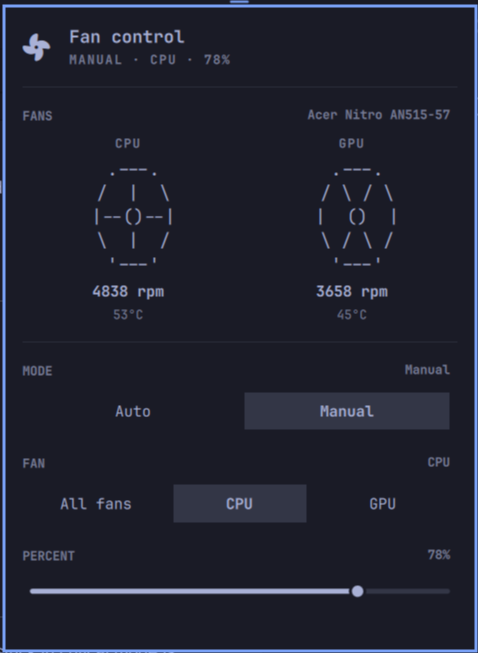

# nbfc-linux Fan Control

An [omarchy](https://omarchy.org) status-bar widget for controlling
[nbfc-linux](https://github.com/nbfc-linux/nbfc-linux) fans — the Linux port of
NoteBook FanControl. It shows each fan as ASCII art that spins faster as the
fan speeds up (with the exact RPM printed below), and lets you switch between
auto and manual control with staged edits that only reach the hardware when you
press **Save**.



## Features

- **Live fan art** — every fan is drawn as ASCII art that oscillates between
  cross and X spokes to look like it's spinning; it spins faster as the fan's
  speed percent climbs (1–4 swaps/sec). The animation only runs while the panel
  is open. Current RPM is printed right underneath, with the temperature
  alongside
- **Auto / Manual mode** — one tap back to nbfc's automatic control, or take
  over and pick a target speed yourself
- **Fan picker** (Manual) — "All fans" or a specific fan (labels pulled from
  the fan names nbfc reports, e.g. "CPU fan" → "CPU"), each seeded with its
  current target speed
- **Percent slider** (Manual) — set the target duty 0–100%
- **Staged changes** — edits are never applied while you drag; a **Save** /
  **Cancel** row appears only once something has changed, and nothing touches
  the fans until you confirm. Save is themed as the primary (filled) action,
  Cancel as the secondary (bordered) one
- **Polling while open** — status refreshes every 2 seconds while the panel is
  open, so the art and numbers stay live without hammering the CLI when closed
- **Service detection** — if `nbfc_service` isn't reachable, the panel shows a
  warning banner and disables the controls instead of failing silently
- Keyboard-navigable popup (j/k/h/l + Enter), matching omarchy's other panels

## Prerequisites

- [nbfc-linux](https://github.com/nbfc-linux/nbfc-linux) with the
  `nbfc_service` systemd service running:

  ```bash
  sudo pacman -S nbfc-linux   # Arch
  systemctl --user start nbfc_service
  ```

- A config for your machine. nbfc ships configs for many laptops; pick one
  with `nbfc config -a` (list all) / `nbfc config -c <name>`, then apply with
  `nbfc config -a` or `nbfc config -c <name>`.

> The widget drives `nbfc` through its `set`/`status` subcommands, so it needs
> the service socket (`/run/nbfc_service.socket`) to be accessible to your
> user. If nbfc is configured to require root for the socket, run the service
> with `nbfc_service`'s `--socket-access` option or adjust the socket unit.
> (On Arch's default package the socket is world-writable, so no extra setup is
> needed.)

## Requirements

- Linux with nbfc-linux (`nbfc_service` running) and a config applied
- [omarchy](https://omarchy.org) (Quickshell-based shell, v4)

## Installation

The repo root is the plugin (`manifest.json` with its `Panel.qml` entry point
live at the top level, per the omarchy plugin layout), so it can be added like
any other omarchy plugin.

**From the UI:** Omarchy Menu > Setup > Plugins > Add Plugin, then enter the
repo URL.

**From the CLI:**

```bash
omarchy plugin add https://github.com/kshatriya-abhay/omarchy-nbfc-linux-plugin
```

## Removal

**From the UI:** Omarchy Menu > Setup > Plugins, select **Fan Control**, then
Remove.

**From the CLI:**

```bash
omarchy plugin remove kshatriya-abhay.nbfc
```

Removal just unloads the widget and deletes the plugin folder. It never
touches `nbfc`, its config, or your fan settings — the fans keep whatever mode
they were in (the same state `nbfc status` reports). To fully restore
automatic control after removing the widget, run:

```bash
nbfc set -a
```

## Dependencies

| Dependency | Why | Notes |
| --- | --- | --- |
| [nbfc-linux](https://github.com/nbfc-linux/nbfc-linux) | Provides the `nbfc` CLI and `nbfc_service` the widget talks to | Required, runtime |
| [omarchy](https://omarchy.org) (Quickshell, v4) | Host shell the widget runs in | Required, runtime |

There are no other runtime dependencies — the widget uses only the QML/JS
built-ins that ship with omarchy (no bundled binaries, no install hooks, no
remote calls).

## Permissions

The widget is read-only with respect to your system: it only runs
`nbfc status` (polling) and `nbfc set` (writes), and `nbfc set` is only
invoked when you press **Save** — never automatically. It does not modify or
overwrite any configuration file, and uninstalling it leaves no state behind.

## Usage

Click the fan icon in the bar to open the panel:

- **Fans** — read-only display at the top: each fan's animated ASCII art, its
  RPM, and temperature.
- **Mode** — choose **Auto** (nbfc controls all fans) or **Manual** (you pick).
  In Auto, no further options are shown.
- **Fan** (Manual only) — "All fans" sets every fan, or pick one specific fan;
  the slider seeds from that fan's current target speed.
- **Percent** (Manual only) — the target duty 0–100%.
- **Save / Cancel** — appears only after a change is staged. **Save** writes
  the pending mode/fan/percent to nbfc; **Cancel** throws the edits away and
  reverts to the applied state.

## Roadmap

- [x] Animated fan art (oscillates between cross and X spokes, faster with speed)
- [x] Animation only runs while the panel is open
- [x] Auto / Manual mode with staged edits (Save / Cancel)
- [x] Per-fan picker with live target seeding
- [x] Percent slider with keyboard support
- [x] 2s polling while the panel is open
- [x] Service-unavailable warning banner (including "only works with nbfc-linux")
- [ ] Config selection — pick among installed nbfc configs from the panel (not planned)

## Known issues

- **Reading critical mode** — nbfc reports `Critical Mode Enabled` in `status`,
  but the panel keeps it read-only for now; a fan stuck in critical mode is
  shown as-is rather than offering a control that could interfere.
- **Configs with many fans** — the fan row lays out one card per fan; very wide
  configs (3+ fans) may crowd the panel width.

## License

[MIT](LICENSE) — Copyright (c) 2026 Abhay Kshatriya